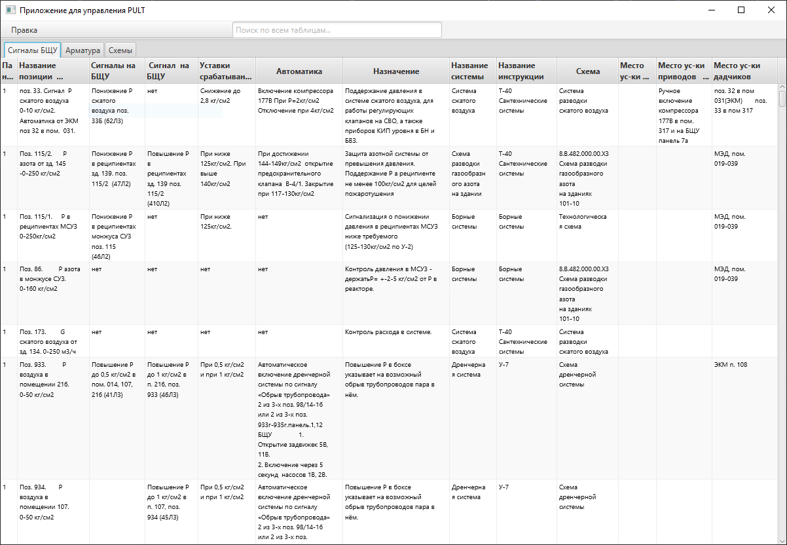

# VK-book-Java: Система управления документацией для оперативного реагирования

---
Для работы над проектом активно использую Gemini, Deepseek, Chatgpt.
## Цель проекта

Этот проект разработан с целью создания эффективного десктопного инструмента на Java для 
**оптимизации работы с технической документацией по оборудованию**. Он направлен на 
**сокращение времени поиска критически важной информации** и 
**повышение оперативности реагирования** персонала, предоставляя удобные средства навигации и работы с данными.

---

## Описание проекта


**"VK-book-Java"** – это десктопное приложение, которое упрощает доступ к специализированной документации, 
такой как сигналы оборудования и схемы, за счет интеллектуального поиска и интеграции с файлами Excel и PDF.



### Ключевые функции и особенности:

* **Интеграция с XLSX-данными**: Приложение взаимодействует с файлами `xlsx` 
(например, `Armatures.xlsx` и `Oborudovanie_BSCHU.xlsx`), расположенными по заданному пути (`\data\Databases\`).
    * Обеспечивается точный перенос данных из Excel в табличный интерфейс с сохранением исходного форматирования 
      ячеек (за исключением объединенных).
    * Автоматическое формирование заголовков таблиц на основе первой строки XLSX-файла.
    * **Функциональность редактирования данных** непосредственно в приложении, с поддержкой операций **Undo/Redo**.
    * **Автоматическая подстройка высоты ячеек** для оптимального отображения текста.

* **Мощный поиск и навигация**:
    * **Общая строка поиска** с динамической подсветкой совпадающих ячеек для быстрого нахождения нужной информации.
    * **Вкладка "Арматура"**: Предоставляет возможность открытия соответствующих **PDF-схем** с автоматическим 
      **масштабированием к конкретной точке** и отображением текстового описания объекта 
        (данные для навигации хранятся в `\data\armature_coords.json`). Ссылки на PDF скрыты в базе данных.
    * **Вкладка "Схемы"**: Универсальный инструмент для просмотра PDF-документов как по внутренним ссылкам, 
        так и путем прямого выбора файла.
        * *Примечание: Производительность при работе с очень большими PDF-файлами может быть ограничена.*

* **Модульная структура интерфейса**: 
    Интуитивно понятный интерфейс разделен на три вкладки для удобного доступа к различным типам информации:
    * **"Сигналы БЩУ"**: Для работы с сигналами блочного щита управления.
    * **"Арматура"**: Для взаимодействия со схемами и описаниями арматуры.
    * **"Схемы"**: Общая вкладка для просмотра любой PDF-документации.

---

## Используемые технологии

* **Язык программирования**: Java (JDK 17)
* **Сборщик проектов**: Apache Maven
* **Графический интерфейс**: JavaFX
* **Разметка UI**: FXML
* **Стилизация UI**: CSS
* **База данных**: MySQL
* **Работа с XLSX**: Apache POI (предполагаемая библиотека для работы с файлами Excel)
* **Работа с PDF**: [Указать конкретную библиотеку, если использовалась, например, PDFBox или JPedal]

---

## Как запустить проект

Для успешной работы приложения убедитесь, что у вас установлены следующие компоненты:

* **Java Development Kit (JDK) 17** или выше.
* **Apache Maven** (для сборки проекта).
* **MySQL Server** (если база данных запускается локально; убедитесь, что параметры подключения в коде соответствуют вашей конфигурации).

1.  **Клонируйте репозиторий**:
    ```bash
    git clone [https://github.com/Flashw0rk/VK-book-Java-.git](https://github.com/Flashw0rk/VK-book-Java-.git)
    cd VK-book-Java-
    ```

2.  **Подготовьте файлы данных**:
    Поместите файлы `Armatures.xlsx` и `Oborudovanie_BSCHU.xlsx` в папку `data/Databases/` в корне проекта.
    Файл `armature_coords.json` также должен находиться в папке `data/`.

3.  **Соберите проект с помощью Maven**:
    ```bash
    mvn clean install
    ```

4.  **Запустите приложение**:
    ```bash
    java -jar target/VK-book-Java-.jar # Или другое имя, которое Maven генерирует
    ```
    *Возможно, потребуется дополнительная настройка JDBC-драйвера MySQL в `pom.xml` и коде.*

---

## Структура проекта

* `src/main/java/`: Исходный код Java.
* `src/main/resources/`: Ресурсы, включая FXML-файлы и CSS.
* `data/Databases/`: Директория для хранения входных XLSX-файлов.
* `data/`: Директория для `armature_coords.json` и других ресурсов.
* `pom.xml`: Файл конфигурации Maven для управления зависимостями и сборкой.

---

## Автор

* **Flashw0rk** (https://github.com/Flashw0rk)
